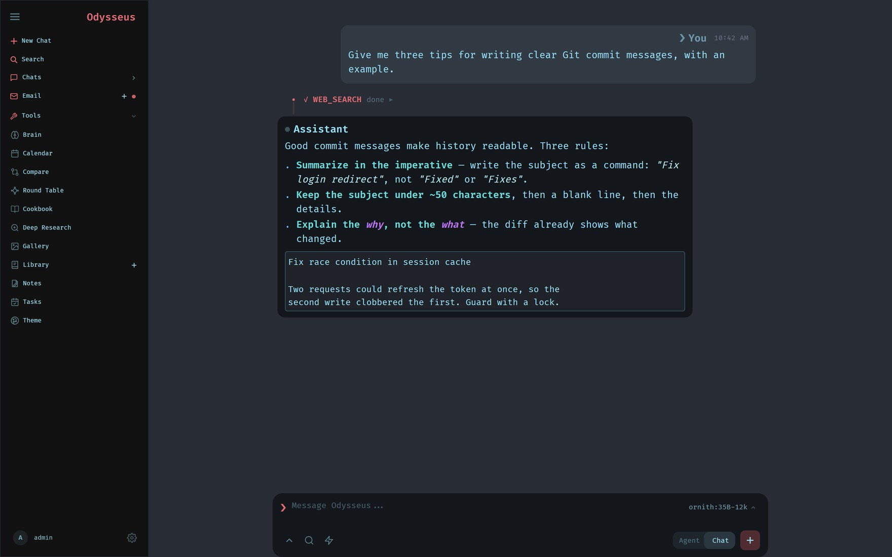
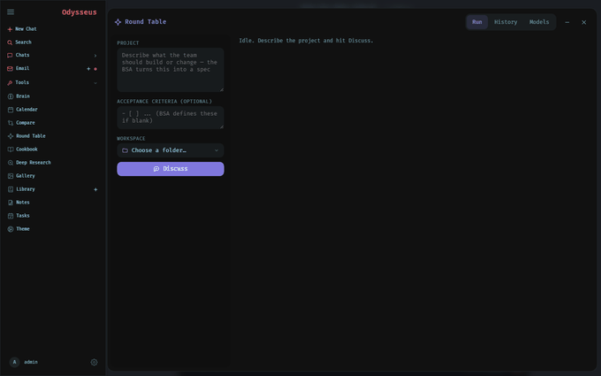
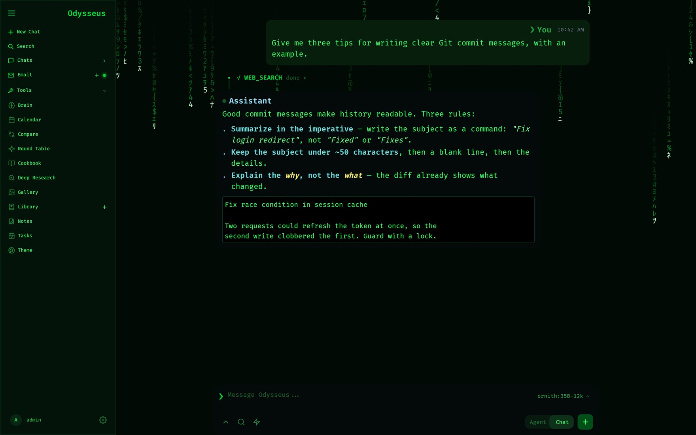

<p align="center">
  
</p>

<p align="center">
  A self-hosted AI workspace for chat, agents, research, documents, email, notes, calendar, and local model workflows.
</p>

<p align="center">
  <a href="#quick-start">Quick Start</a> ·
  <a href="docs/setup.md">Setup Guide</a> ·
  <a href="CONTRIBUTING.md">Contributing</a> ·
  <a href="ROADMAP.md">Roadmap</a>
</p>

<p align="center">
  <a href="https://repology.org/project/odysseus-ai/versions"></a>
</p>

<p align="center">
  
</p>

---

## 🤝 Odysseus × SAW — the Round Table

> **This is a community fork that combines [Odysseus](https://github.com/pewdiepie-archdaemon/odysseus) with the [SAFe Agentic Workflow (SAW)](https://github.com/bybren-llc/safe-agentic-workflow), built with [Claude](https://claude.com/claude-code), to give Odysseus an easy-to-understand, end-to-end AI agentic workflow — the _Round Table_.**

Instead of one chatbot guessing at an entire task, a small **team of role-specialized AI agents** passes the work down a real assembly line — **Analyst → Architect → Developer → QA → Security → Tech Writer → Release** — each reviewing the previous one's output behind quality gates. You write one ticket; the team plans, builds, tests, and documents working code right in your workspace.

### What it brings to Odysseus

- 🧩 **One ticket → working software** — describe what you want and seven agents take it from spec to shipped code, no step-by-step prompting.
- 🚦 **Quality gates, not vibes** — a deterministic build/structure check (a Flutter app must really have a runnable `lib/main.dart`; Python must compile; `flutter analyze` must be clean) plus independent QA and Security reviews catch broken work *before* it can pass.
- 🎚️ **Per-role model routing** — run the Developer on a strong API model and the rest on free local Ollama models, or any mix, from the ⚙ Models panel — cost and privacy on your terms.
- 🔁 **Continue the discussion** — after a run, just ask for changes; the team remembers what it built and iterates on top instead of starting over.
- 🕘 **History & reuse** — every run is saved; replay any ticket or load it back into the form.
- 🔐 **Least-privilege agents** — non-coding roles can't execute commands, so a reviewer can't edit the code it's grading and a writer can't launch your app.
- 🤝 **Human-in-the-loop releases** — work commits to your branch locally, or opens a real GitHub PR — your call.

Open it from the **⊹ Round Table** button in the left rail. Full walkthrough in the **[Round Table guide](docs/round-table.md)**.

<p align="center">
  
</p>

---

## Quick Start

### 🪟 Windows — one-click installer (easiest)

Grab **`OdysseusSetup.exe`** from the [latest release](https://github.com/Z-Gamez/odysseus-roundtable/releases/latest) and run it. It installs a fully self-contained app (no Python, no Docker, no setup) with a Start Menu shortcut. For local AI models, install [Ollama](https://ollama.com/download) — the installer offers this if it's not found; cloud API models work without it.

### 🍎 macOS — drag-and-drop app (Apple Silicon)

Grab **`Odysseus-macOS-arm64.dmg`** from the [latest release](https://github.com/Z-Gamez/odysseus-roundtable/releases/latest), open it, and drag **Odysseus** into **Applications**. The app is self-contained (no Python, no Docker).

It isn't notarized with Apple, so recent macOS versions block the first launch with a misleading *"Odysseus is damaged"* dialog (the app is fine — that's Gatekeeper-speak for "not notarized"). Unblock it once with:

```bash
xattr -cr /Applications/Odysseus.app
```

then open it normally. (Alternative: **System Settings → Privacy & Security → Open Anyway**.) For local AI models, install [Ollama for macOS](https://ollama.com/download/mac); cloud API models work without it.

### 🐳 Docker (any platform)

> `dev` and `saw-harness` both track the newest changes in this fork.

```bash
git clone https://github.com/Z-Gamez/odysseus-roundtable.git
cd odysseus-roundtable
cp .env.example .env
docker compose up -d --build
```

Open `http://localhost:7000` when the containers are healthy. The first admin password is printed in `docker compose logs odysseus`.

### Building the Windows installer yourself

```powershell
venv\Scripts\python.exe -m PyInstaller --noconfirm OdysseusFull.spec   # -> dist\OdysseusStandalone
& "$env:LOCALAPPDATA\Programs\Inno Setup 6\ISCC.exe" installer\odysseus.iss   # -> installer\Output\OdysseusSetup.exe
```

Native installs, GPU notes, macOS instructions, HTTPS, and configuration live in the [setup guide](docs/setup.md).

## Features

- **Chat + Agents** — local/API models, tools, MCP, files, shell, skills, and memory.
- **Local backends** — **Ollama** and **llama.cpp** both work as first-class targets. Odysseus asks each server what it can actually do (Ollama's `/api/show`, llama.cpp's `/props`) rather than guessing from the model name, so tool-capable models get native function calling instead of silently falling back to fenced text blocks. One **context window** setting in AI defaults governs both, and llama-server is launched to match it. If `llamacpp_enabled` is set, llama.cpp starts and stops with Odysseus.
- **Remote execution (SSH)** — set `agent_execution_target` to `ssh:user@host` and the agent's `bash`/`python` tools run on that machine while the UI, database and model routing stay local. Aimed at work that is heavy to *execute* — Gradle, Flutter, test suites. It does **not** move the model: an endpoint's `base_url` already accepts any host, so running a model too big for this machine is an endpoint change, not this setting. Round Table roles inherit it through their tool calls; the deterministic build gate still runs locally.
- **Fast Mode** — a chat-bar toggle that turns off a reasoning model's thinking step for quick turns. It sends the right signal per backend (`reasoning_effort` for Ollama, the chat template for llama.cpp), not just the `/no_think` prompt convention, so it works on both.
- **Cookbook** — hardware-aware model recommendations, downloads, and serving.
- **Deep Research** — multi-step web research with source reading and report generation.
- **Compare** — blind side-by-side model testing and synthesis.
- **Documents** — writing-first editor with AI edits, suggestions, Markdown, HTML, CSV, and syntax highlighting.
- **Email** — IMAP/SMTP inbox with triage, tags, summaries, and reply drafts. Agents can compose and send, gated behind an in-chat **Approve / Decline** card so nothing leaves without your click.
- **Messages (macOS)** — the agent can send and read iMessage/SMS. Sending is gated behind the same **Approve / Decline** card: just ask ("text Alex that I'm running late") and nothing leaves until you click approve. You can address people by name — contacts are resolved from CardDAV and your mail history, so "text Alex" works without you knowing the number. Delivery runs through Messages directly via AppleScript; **no Shortcut setup is required**. The first send raises a macOS Automation permission prompt for Messages — approve it once and it persists. Reading works too ("what did Alex say yesterday?"), straight from the local Messages database, read-only.
- **Browser** — the agent drives your **real Chrome** (your logins, bookmarks) over the DevTools Protocol on any platform. On macOS you can switch it to your **real Safari** instead — say "use Safari for the browser". Safari needs a one-time enable: run `safaridriver --enable` in Terminal, then Safari → Develop → **Allow Remote Automation**.
- **Notes, Tasks + Calendar** — reminders, todos, scheduled agent tasks, and CalDAV sync.
- **Round Table** — a SAFe multi-agent team (BSA → Architect → Developer → QA → Security → Tech Writer → RTE) that ships a ticket through real quality gates, with per-role model routing, a deterministic build gate, follow-up iterations, and human-in-the-loop merge. See [docs/round-table.md](docs/round-table.md).
- **Themes** — a borderless, minimal restyle with a dozen presets and live animated backgrounds, including a **Matrix** theme with digital rain.
- **Extras** — gallery/image editor, uploads, web search, presets, sessions, and 2FA.

<p align="center">
  
</p>

## Demo

A full hover-to-play tour lives on the landing page: [`docs/index.html`](docs/index.html).

## Contributing

Help is welcome. The best entry points are fresh-install testing, provider setup bugs, mobile/editor polish, docs, and small focused refactors. See [CONTRIBUTING.md](CONTRIBUTING.md) and [ROADMAP.md](ROADMAP.md).

## Security

Odysseus is a self-hosted workspace with powerful local tools. Keep auth enabled, keep private data out of Git, and do not expose raw model/service ports publicly. Deployment details are in the [setup guide](docs/setup.md#security-notes).

## Star History

Stars for the **upstream** project this fork is built on ([odysseus-dev/odysseus](https://github.com/odysseus-dev/odysseus)) — not this fork.

<a href="https://www.star-history.com/?repos=odysseus-dev%2Fodysseus&type=date&legend=top-left">
 <picture>
   <source media="(prefers-color-scheme: dark)" srcset="https://api.star-history.com/chart?repos=odysseus-dev/odysseus&type=date&theme=dark&legend=top-left" />
   <source media="(prefers-color-scheme: light)" srcset="https://api.star-history.com/chart?repos=odysseus-dev/odysseus&type=date&legend=top-left" />
   
 </picture>
</a>

## License

AGPL-3.0-or-later -- see [LICENSE](LICENSE) and [ACKNOWLEDGMENTS.md](ACKNOWLEDGMENTS.md).
